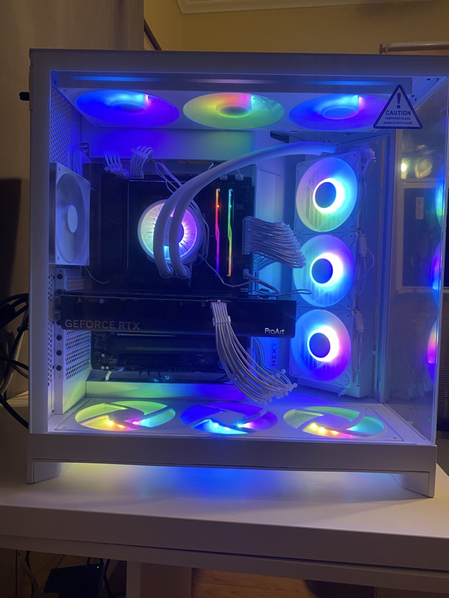

# 🏛️ Ship of Theseus | High-Performance Research Node

  

## 🔬 Research Vision & PhD Pathway
[cite_start]I am an Electrical Engineering student at **Texas State University** (Concentration: **Micro & Nano Devices**)[cite: 7, 8]. [cite_start]This workstation, the "Ship of Theseus," is my primary hub for self-directed research, simulating experiments, and bridging theoretical coursework with physical engineering[cite: 17, 18].

[cite_start]Everything built here is a foundational step toward my ultimate objective: earning a **PhD in Materials Science, Engineering, and Commercialization (MSEC)**[cite: 7].

---

## 📅 Professional Availability
[cite_start]I am actively seeking **Co-op opportunities (Summer 2026 – Winter 2026)** or Undergraduate Research positions[cite: 5]. [cite_start]I am prepared for 6-8 month extended rotations to contribute to long-term engineering pipelines[cite: 5].

### 🎯 Target Roles:
* [cite_start]**Digital Logic / RTL Design Intern:** Applying SystemVerilog for bio-inspired compute models[cite: 14].
* [cite_start]**Hardware Test & Diagnostics Intern:** Proficient in component-level PCB probing and multimeter diagnostics[cite: 21].
* [cite_start]**Systems Programming Intern (Rust/Linux):** Developing localized CLI agents and performance monitors on Fedora[cite: 17, 18].
* [cite_start]**Micro/Nano Research Assistant:** Supporting Bio-MEMS simulation and laboratory characterization[cite: 8].

---

## 🛠️ Hardware Architecture (The Physical Layer)
*Optimized for raw performance and high-throughput engineering simulations.*

| Component | Specification | Research Utility |
| :--- | :--- | :--- |
| **CPU** | AMD Ryzen 9 9950X (16-Core) | [cite_start]High-speed RTL simulation & multi-threaded workloads[cite: 9]. |
| **GPU** | ASUS ProArt RTX 5080 OC | [cite_start]CUDA acceleration for AI-driven discovery & Bio-MEMS[cite: 9]. |
| **RAM** | 64GB G.SKILL DDR5 (6000MT/s) | [cite_start]Handling large datasets for Digital Twin simulations[cite: 9]. |
| **Storage** | 2TB Crucial T700 Gen 5 | [cite_start]Ultra-fast I/O for real-time diagnostic logging[cite: 9]. |
| **OS** | Fedora Linux | [cite_start]Native environment for Rust and SystemVerilog development[cite: 18]. |

---

## 🚀 Active Projects & Lab Work

### 1. Neuromorphic Logic Design (**SystemVerilog & Rust**)
* [cite_start]Developing bio-inspired AND gate models to explore neural-weight behavior versus standard RTL logic[cite: 14, 15].
* [cite_start]Creating testbenches to verify signal behavior and strengthen digital logic fundamentals[cite: 16].

### 2. "Ship of Theseus" Dev Agent (**Rust CLI**)
* [cite_start]Building a command-line tool to organize local AI model sessions and track development logs on Fedora Linux[cite: 17, 18].

### 3. Hardware Forensics: **RX 5700 PCB Diagnostics**
* [cite_start]Using a digital multimeter and schematics to map power rails and identify shorts on a non-functional GPU[cite: 21].
* [cite_start]Learning to connect schematic theory with real-world PCB behavior and board-level repair[cite: 22].

### 4. Thermal ML Watchdog (**In-Pipeline**)
* Developing a localized Machine Learning model to monitor system thermals and performance metrics during heavy compute cycles.

---

## 🛠️ Technical Skill Matrix
* [cite_start]**Languages:** Rust, SystemVerilog, C++, Python (Pandas/Matplotlib), JavaScript[cite: 24].
* [cite_start]**Engineering:** Digital Logic, Signal Timing, PCB Probing, Circuit Analysis[cite: 25].
* [cite_start]**Tools:** Git/GitHub, VS Code, Fedora Linux, Muse EEG Hardware[cite: 25].

---

## 📫 Connect with Me
* [cite_start]**LinkedIn:** [Raul Montoya Cardenas](https://linkedin.com/in/raul-montoya-cardenas-8aa09839a) [cite: 2]
* [cite_start]**University:** Texas State University - San Marcos [cite: 7]
* [cite_start]**Portfolio:** [raul-biomems.github.io](https://raul-biomems.github.io/) [cite: 2]
